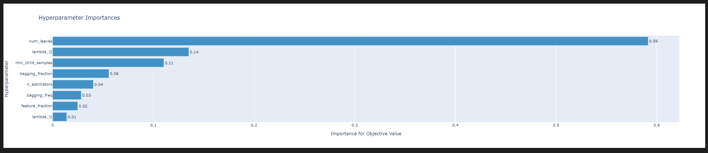
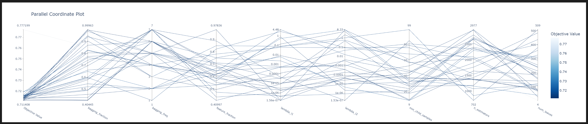
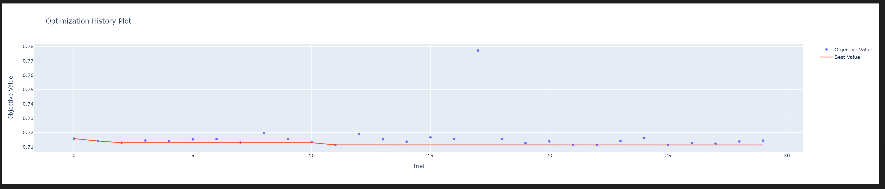

> # Predict Future Sales

## 데이터와 모듈 불러오기

```python
# 기본적인 모듈만 우선 import
import numpy as np 
import pandas as pd 
import matplotlib.pyplot as plt
import seaborn as sns
sns.set(style="darkgrid")

# dataset 불러오기
items = pd.read_csv("/content/items.csv")
shops = pd.read_csv("/content/shops.csv")
train = pd.read_csv("/content/sales_train.csv")
test = pd.read_csv("/content/test.csv")
cats = pd.read_csv("/content/item_categories.csv")

```
## 결측치 확인
```python
train.isnull().sum()
shops.isnull().sum()
items.isnull().sum()
test.isnull().sum()
cats.isnull().sum()

train.info()
# 결측치는 없었음
```

## 이상치 확인 및 제거

```python
plt.figure(figsize=(10,4))
plt.xlim(-100, 3000)
flierprops = dict(marker='o', markerfacecolor='purple', markersize=6,
                  linestyle='none', markeredgecolor='black')
sns.boxplot(x=train.item_cnt_day, flierprops=flierprops)

plt.figure(figsize=(10,4))
plt.xlim(train.item_price.min(), train.item_price.max()*1.1)
sns.boxplot(x=train.item_price, flierprops=flierprops)
# 데이터 분포 시각화하여 우선 확인

#로그로 변환
train['item_price'] = train['item_price'].clip(lower=1)
train['ln_price'] = np.round(np.log(train['item_price'])*10).astype('str')
#실수형 타입으로 재변환
train['ln_price'] = train['ln_price'].astype(float)

#z_score적용
mean = np.mean(train.ln_price,axis = 0)
std = np.std(train.ln_price,axis =0)
train.ln_price = (train.ln_price - mean)/std
# 시각화
sns.displot(data=train, x='ln_price',kde = True)

import seaborn as sns

#z_score 기준으로 편차가 큰 값들 제거
filtered_train = train.loc[(train['ln_price'] < 2.5) & (train['ln_price'] > -2.5)]


sns.displot(data=filtered_train, x='ln_price', kde=True)


# 원본에서도 동일한 범위로 이상치로 판단된 데이터를 한번 지우고 확인을해봤는데
데이터 손실이 너무 많이 발생합니다(5만개이상).

## 범위를 -5~5로 지정해줬더니 손실량이 1000개가량으로 줄어들긴함.
```
## 시계열 데이터 EDA

```python
# 평균과 표준편차 확인 ts = total sales임 위에서 정의된 group_month_sum과 동일
plt.figure(figsize=(16,6))
plt.plot(ts.rolling(window=12,center=False).mean(),label='Rolling Mean');
plt.plot(ts.rolling(window=12,center=False).std(),label='Rolling sd');
# 과거 12개월 기준으로 LAG잡음.
# center는 윈도우설정의 방향?기준을 말함 center가 true인 경우 양옆으로 6개씩을 기준(window가 12이므로)으로 rolling하여 lagdata를 만듬
plt.legend();
```

데이터를 보면 데이터가 어떠한 추세를 가지고 있다는 것을 확인할 수 있다.

```python
import statsmodels.api as sm
res = sm.tsa.seasonal_decompose(ts.values, model='multiplicative', period=12)
# multiplicative는 잔차,트렌드,계절성을 곱해서 나타냄.
fig, (ax1, ax2, ax3, ax4) = plt.subplots(4, 1, figsize=(16,12))
ax1.plot(ts.values)
ax1.set_title("Observed")
ax2.plot(res.trend)
ax2.set_title("Trend")
ax3.plot(res.seasonal)
ax3.set_title("Seasonal")
ax4.plot(res.resid)
ax4.set_title("Residual")
```

추세와 잔차 계절성을 한눈에 확인할 수 있다.
**잔차란?** 잔차는 표본집단으로부터 추정한 회귀식과 실제 관측값의 차이를 말한다.

모집단으로부터 추정한 회귀식과 실제 관측값의 차이를 추정한 오차와 비슷한 개념이지만 표본집단과 모집단이라는 차이가 존재한다.


```python
## windowed aggerated 시각화
import seaborn as sns
shop_id = 16
item_id = 482
sns.set_style('white')

im = matrix.query(f"shop_id=={shop_id} & item_id=={item_id}")[['date_block_num', 'item_cnt_month']]
im['moving average'] = im['item_cnt_month'].ewm(halflife=1).mean()
im['expanding mean'] = im['item_cnt_month'].expanding().mean()
im['rolling 12 month mean'] = im['item_cnt_month'].rolling(window=12, min_periods=1).mean()
im = im.set_index('date_block_num')

# Use seaborn to create a line plot
plt.figure(figsize=(20,10))
sns.lineplot(data=im, x='date_block_num', y='item_cnt_month',  marker='o', label='item_cnt_month',linewidth=4,markersize=10)
sns.lineplot(data=im, x='date_block_num', y='moving average', marker='o', label='moving average',linewidth=4,markersize=10)
sns.lineplot(data=im, x='date_block_num', y='expanding mean', marker='o', label='expanding mean',linewidth=4,markersize=10)
sns.lineplot(data=im, x='date_block_num', y='rolling 12 month mean', marker='o', label='rolling 12 month mean',linewidth=4,markersize=10)

# Add a title and labels to the x and y axes
plt.title('Time series averaging methods')
plt.xlabel('Date')
plt.ylabel('Item count')
```


## Parameter Tuning(OPTUNA)시각화

### OPTUNA?
- 하이퍼파라미터 튜닝에 쓰이는 최신 AutoML기법 중 하나.
- 하이퍼파라미터 튜닝 방식 지정가능(정확히는 하이퍼파라미터의 범위를 지정하면 그 범위안의 랜덤한 값들을 반복하여 실행하면서 최적의 파라미터를 찾는 것) 때문에 직관적이라는 장점이 있음

- GPT님의 optuna 설명 어렵지 않으니 읽어봐도 좋을듯하다.

### sample code
```python
import optuna

def objective(trial):
    # 당연한 얘기지만 무슨 모델을 선택하느냐에 따라 하이퍼 파라미터 선택도 달라져야한다.
    # Define the parameters you want to optimize
    alpha = trial.suggest_float('alpha', 0.0, 1.0)
    beta = trial.suggest_int('beta', 0, 10)

    # Define your machine learning model

    model = MyModel(alpha, beta)

    # Fit the model and evaluate its performance
    model.fit(X_train, y_train)
    score = model.evaluate(X_test, y_test)

    return score

study = optuna.create_study()
# optuna
study.optimize(objective, n_trials=100)
# 위에서 정의한 함수를 인자로 사용하여 최적화 과정을 실행하게 된다.
# n_trials는 반복횟수를 의미한다.

print("Best trial:")
trial = study.best_trial
# 최적값을 찾아내줌
# 아래는 best_trial이 반환해주는 값들
value: 해당 시도에 대한 목적 함수에서 반환한 값.
params: 해당 시도에 사용된 하이퍼파라미터 세트.
state: 시도의 상태(예: 성공 여부, 건너뛰기 여부 등).
datetime_start: 시도(trials)가 시작된 날짜 및 시간입니다.
datetime_complete:시도가(trials)  완료된 날짜 및 시간입니다.
print("  Value: ", trial.value)
print("  Params: ")
for key, value in trial.params.items():
    print(f'    {key}: {value}')
```

### Light GBM parameters

- 'boosting_type': 사용할 부스팅 알고리즘의 종류를 말한다. 대표적으로
"gbdt"(Gradient Boosting Decision Tree)가 있고 "dart"(Dropouts meet Multiple Additive Regression Trees)가 있다. 그 외에...  rf,goss등등

- 'num_leaves': 트리의 최대 가지수를 의미한다.

- 'learning_rate': 학습률

- 'min_child_weight': 새 분할 생성을 위해 하위 노드에 필요한 최소 샘플의 개수.

- 'n_estimators' : LightGBM의 핵심 매개변수 중 하나로서, 모델의 트리수를 나타낸다. 트리가 많을수록 모델이 복잡해지고 train set에 과적합될 가능성이 있으나, 복잡한 패턴을 잡아내는 모델 기능은 향상될 수 있다.

- 'feature_fraction' : LightGBM의 매개 변수로, 각 트리를 구성하는데 사용되는 피쳐의 부분을 나타낸다. feature의 수가 많은 경우 과적합을 제어하는데 좋다.
feature_fraction이 1보다 작은 값으로 설정된 경우, 각 트리에서 사용할 feature의 하위 집합을 임의로 선택한다. ->> 이 경우, 모델이 단일 feature에 너무 많이 의존하지 않아서 과적합을 줄일 수 있다.(default=1)

- 'bagging_fraction': LightGBM의 매개 변수로 각 트리에 사용할 데이터의 부분을 나타내며, 각 트리에 대한 데이터의 랜덤 하위 샘플링을 제어한다.
feature_fraction과 마찬가지로 deafault값은 1이며, 이보다 작을 경우 트리에 사용할 데이터의 하위집합을 임의 설정하여 모델이 특정 데이터에 지나치게 의존하지 않도록 하여 과적합을 줄일 수 있다.

- 'baggin_freq': bagging_fraction과 같이 동작하며, bagging이 수행될 이후 반복 횟수를 제어한다. 0이면 bagging이 비활성화되고, 0보다 크면 bagging freq를 반복할때 마다 bagging이 수행된다. (정수만 써야되는지 한번 확인해보자)

- 'verbosity'는 LightGBM의 매개 변수로, 훈련 중 모델에 의해 생성된 출력 수준을 다음과 같이 제어한다.

1. 0: 출력x
2. 1: 작성된 트리수 및 현재 학습점수와 같은 학습 프로세스에 대한 메시지를 출력한다.
3. 2: 메시지와 각 노드의 기능 중요도 및 분할값과 같은 트리에 대한 자세한 정보까지 출력한다.


- 'lambda_l1','lambda_l2': 모델의 가중치에 적용되는 L1정규화(Lasso) 및 L2정규화(Ridge)의 양을 제어하는 매개변수이다. 매개 변수값이 클수록 정규화가 더 강하므로 과적합 문제를 핸들링 할 때, 값을 조절해가며 사용해 줄 수 있다.


파라미터가 100개가 넘어가기때문에 이외에 더 자세한 정보는 아래를 참조하라고 하면 좋을듯 하다. 

[참조1doc]('https://lightgbm.readthedocs.io/en/latest/Parameters.html')

[참조2개요]('https://nicola-ml.tistory.com/51')


### 진행중인 pjt에 optuna 적용

```python
# 함수선언
# 모델이 LGBM이기때문에 이에 맞는 parameters를 설정해준다.
def objectiveLGBM(trial: Trial, X_train, y_train, X_valid, y_valid):
    param = {
        'objective': 'regression',
        'metric': 'root_mean_squared_error',
        'verbosity': -1,
        'boosting_type': 'gbdt',
        'lambda_l1': trial.suggest_loguniform('lambda_l1', 1e-7, 10.0),
        'lambda_l2': trial.suggest_loguniform('lambda_l2', 1e-7, 10.0),
        'num_leaves': trial.suggest_int('num_leaves', 2, 512),
        'learning_rate': 0.01,
        'n_estimators': trial.suggest_int('n_estimators', 700, 3000),
        'feature_fraction': trial.suggest_uniform('feature_fraction', 0.4, 1.0),
        'bagging_fraction': trial.suggest_uniform('bagging_fraction', 0.4, 1.0),
        'bagging_freq': trial.suggest_int('bagging_freq', 1, 7),
        'min_child_samples': trial.suggest_int('min_child_samples', 5, 100),
        'device':"gpu",
        'gpu_use_dp':True
    }
    #X_train, X_test, y_train, y_test = train_test_split(X, y.flatten(), test_size=0.1)
    #max_depth가 들어가면 결과는 더 좋아질 수 있을듯 하다.    
    model = LGBMRegressor(**param)
    lgbm_model = model.fit(X_train, y_train, verbose=False)
    
    score = mean_squared_error(lgbm_model.predict(X_valid), y_valid, squared=False)
    # mean sqaured error에서 squared = False는 RMSE로 평가하겠다는 것을 의미(default는 True)
    return score
study = optuna.create_study(direction='minimize',sampler=TPESampler())
# direction은  score값을 최대 또는 최소로하는 것을 지정해준다
# 이 경우는 score 값이 rmse이기 때문에, 손실함수를 최소한으로 해준것이 목표이므로 minimize로 설정해준다.
study.optimize(lambda trial : objectiveLGBM(trial, X_train,y_train,X_valid,y_valid), n_trials=1)
# 첫 시도라 런타임나가는게 두려워서  n_trials=1로 소심하게 시작...
print('Best trial: score {},\nparams {}'.format(study.best_trial.value,study.best_trial.params))
best_param = study.best_trial.params
```


### 이후 더 진행될 시각화 과정
```python
# optuna 시각화 
optuna.visualization.plot_param_importances(study)
optuna.visualization.plot_optimization_history(study)
optuna.visualization.plot_parallel_coordinate(study)

# 공통적인 오류 코드 
# 아마도 plotly 5.12버전이 완전히 지워지지않은 상태에서 4.14버전을 깔아서그런거같습니다.
# 오류 내용 확인결과 ndformat의 버전 문제라길래 최신으로 !pip install --upgrade ndformat으로 
업그레이드 해봤으나 해결되지는않았습니다.
ValueError: Mime type rendering requires nbformat>=4.2.0 but it is not installed

optuna.visualization.plot_optimization_history(study)
# 하이퍼 파라미터 최적화 과정 확인
optuna.visualization.plot_param_importances(study)
# 하이퍼 파라미터별 중요도 확인가능 
optuna.visualization.plot_parallel_coordinate(study)
# 하이퍼 파라미터간 관계 확인가능 
```




